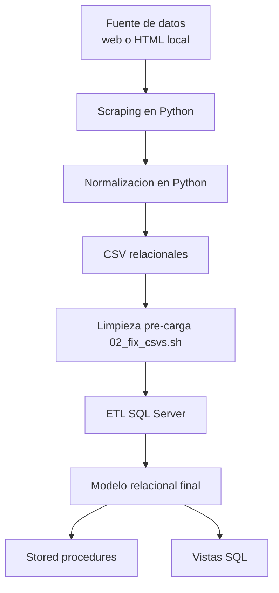
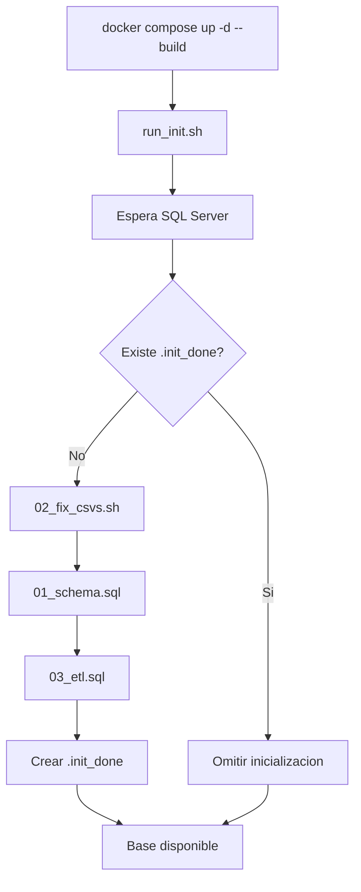

# Manual Tecnico del Proyecto Mundiales

## 1. Indice

- [2. Alcance y objetivos](#2-alcance-y-objetivos)
- [3. Arquitectura general](#3-arquitectura-general)
- [4. Estructura del repositorio](#4-estructura-del-repositorio)
- [5. Proceso de recoleccion de datos](#5-proceso-de-recoleccion-de-datos)
- [6. Proceso de normalizacion y generacion de CSV](#6-proceso-de-normalizacion-y-generacion-de-csv)
- [6.4 Politica de canonizacion historica y no unicidad controlada](#64-politica-de-canonizacion-historica-y-no-unicidad-controlada)
- [7. Carga en Docker y SQL Server](#7-carga-en-docker-y-sql-server)
- [8. Diccionario tecnico de la base de datos](#8-diccionario-tecnico-de-la-base-de-datos)
- [9. Stored procedures](#9-stored-procedures)
- [10. Seccion para vistas SQL](#10-seccion-para-vistas-sql)
- [11. Operacion diaria](#11-operacion-diaria)
- [12. Validaciones recomendadas](#12-validaciones-recomendadas)
- [13. Troubleshooting](#13-troubleshooting)
- [14. Seguridad y mantenimiento](#14-seguridad-y-mantenimiento)
- [15. Decision tecnica sobre uso de dbo](#15-decision-tecnica-sobre-uso-de-dbo)
- [16. Fase 2: Simulacion y auditoria de rendimiento](#16-Fase-2:—Simulacion-y-auditoria-de-rendimiento)

## 2. Alcance y objetivos

Este proyecto construye una base de datos historica de mundiales de futbol, desde 1930 hasta 2026, mediante un pipeline ETL completo.

Objetivos principales:

- Extraer informacion historica desde fuente web o cache local de HTML.
- Transformar y normalizar los datos a un modelo relacional consistente.
- Cargar el dataset en SQL Server dentro de Docker.
- Exponer consultas analiticas mediante stored procedures.
- Preparar la base para vistas SQL orientadas a analitica y reporteria.
- Simular cargas masivas diarias para el Mundial 2030 ficticio y registrar fragmentación e índices en tablas de auditoría.
- Ejecutar y documentar estrategias de respaldo (full backup e incremental/diferencial) y restauración.

Cobertura aproximada del dataset:

- 23 ediciones de mundial.
- 888+ partidos.
- 1000+ jugadores.
- 230+ selecciones.

## 3. Arquitectura general



Capas tecnicas:

- Capa de extraccion: py/scraping_normalizado.py
- Capa de transformacion: py/normalizacion_csv.py
- Capa de limpieza pre-carga: docker/init/02_fix_csvs.sh
- Capa de persistencia: py/db/sqlserver_schema.sql
- Capa de carga: py/db/sqlserver_etl.sql
- Capa de consulta: py/db/stored_procedures.sql y vistas SQL

## 4. Estructura del repositorio

```text
bases2_proyecto1/
|-- README.md
|-- Dockerfile
|-- docker-compose.yml
|-- docker/
|   `-- init/
|       |-- run_init.sh
|       |-- 01_schema.sql
|       |-- 02_fix_csvs.sh
|       `-- 03_etl.sql
|-- fase2/
|   `-- sql/
|       |-- 02_Carga_Catalogos_2030.sql
|       |-- 03_Simulacion_Dia1_Grupos.sql
|       |-- 04_Simulacion_Dia2_Finales.sql
|       |-- 05_Update_Dia3_Mayusculas.sql
|       `-- 06_Validacion_Fase2.sql
|-- py/
|   |-- scraping_normalizado.py
|   |-- normalizacion_csv.py
|   `-- db/
|       |-- sqlserver_schema.sql
|       |-- sqlserver_etl.sql
|       |-- stored_procedures.sql
|       |-- performance_audit_logs.sql
|       |-- modelo_wc.dbml
|       `-- ejemplos_procedure.txt
|-- datos_normalizados_web/
|-- datos_normalizados_local/
|-- html_descargados/
`-- docs/
    `-- manualtecnico.md
```

## 5. Proceso de recoleccion de datos

Esta seccion describe en detalle como se recolecta la informacion y por que se diseno de esta forma.

### 5.1 Fuentes de datos

Origenes soportados:

- Origen web: consulta directa al sitio https://www.losmundialesdefutbol.com
- Origen local: lectura de archivos HTML desde html_descargados/

Motivo de doble fuente:

- Modo local facilita depuracion y pruebas repetibles.
- Modo web asegura cobertura y actualizacion de datos para corridas finales.

### 5.2 Estrategia de acceso web

El scraper usa Microsoft Edge en modo headless para descargar DOM final.

Razon tecnica:

- El sitio puede aplicar bloqueo tipo 403 a clientes no navegadores.
- Usar Edge headless permite obtener HTML renderizado de forma estable sin Selenium.

Flujo de lectura por origen:

- Si origen es local: abre archivo HTML mapeado desde la ruta del sitio.
- Si origen es web: resuelve URL, descarga con Edge headless y aplica pausa configurable.

### 5.3 Logica de extraccion

El scraper divide la recoleccion por secciones del dominio:

- mundiales
- selecciones
- jugadores
- partidos
- grupos
- posiciones
- goleadores
- premios
- planteles
- eventos por partido (goles, tarjetas, cambios, penales)

Tecnicas clave de parseo:

- Limpieza de texto y espacios.
- Extraccion de enteros y pares de marcador por regex.
- Resolucion de nombres desde enlaces, imagenes y atributos HTML.
- Estandarizacion de rutas y slugs.

### 5.4 Controles durante recoleccion

Controles aplicados:

- Deduplicacion por llaves de negocio temporales.
- Validacion de nombres vacios o genericos.
- Parseo robusto de minutos y resultados.
- Parseo contextual de definicion por penales para evitar capturar anios del menu del sitio.
- Manejo de faltantes sin romper el flujo.

## 6. Proceso de normalizacion y generacion de CSV

Despues del scraping, normalizacion_csv.py transforma datos intermedios al modelo relacional final.

### 6.1 Reglas de normalizacion

- Separacion de entidades por grano:
  - premio_jugador y premio_seleccion.
  - plantel_jugador y plantel_entrenador.
  - grupo y participacion_mundial.
- Unificacion de alias historicos de seleccion.
- Registro de posibles ambiguedades de identidad de jugador.

### 6.2 Salida final de archivos CSV

Se generan 21 archivos:

- mundial.csv
- seleccion.csv
- seleccion_alias.csv
- jugador.csv
- entrenador.csv
- partido.csv
- aparicion_partido.csv
- direccion_tecnica_partido.csv
- gol.csv
- tarjeta.csv
- cambio.csv
- penal.csv
- grupo.csv
- posicion_final.csv
- goleador.csv
- premio_jugador.csv
- premio_seleccion.csv
- plantel_jugador.csv
- plantel_entrenador.csv
- participacion_mundial.csv
- resolucion_identidad_jugador.csv

### 6.3 Normalizacion de caracteres

En docker/init/02_fix_csvs.sh se aplica limpieza adicional para compatibilidad con SQL Server sobre Linux:

- Eliminacion de diacriticos y conversion a ASCII.
- Correccion de enteros y booleanos.
- Deduplicacion por llave primaria esperada.
- Garantia de existencia de resolucion_identidad_jugador.csv.
- La ruta de trabajo de CSV se toma desde la variable de entorno `CSV_DIR` cuando se ejecuta en Docker.

### 6.4 Politica de canonizacion historica y no unicidad controlada

La canonizacion de selecciones sigue dos metas en paralelo:

- Unificar nombres para consulta analitica en una seleccion canonica.
- Conservar hechos historicos sin borrar registros validos de la fuente.

Alias historicos activos en el proyecto:

- Alemania Occidental y Alemania Oriental -> Alemania (agregacion historica tras la reunificacion).
- URSS -> Rusia (sucesion historica usada para agregacion estadistica).
- RF de Yugoslavia y Serbia y Montenegro -> Serbia (continuidad historica en la serie de selecciones).
- Checoslovaquia -> Republica Checa (continuidad historica para agregacion de registros).
- Holanda y Paises Bajos -> Paises Bajos (variacion linguistica y ortografica).

Implicacion tecnica intencional:

- participacion_mundial puede contener mas de una fila para la misma combinacion (anio, seleccion_id).
- posicion_final puede repetir (anio, posicion) y tambien (anio, seleccion_id) en casos historicos validos.
- Estas repeticiones no son corrupcion de datos; preservan fidelidad historica despues de canonizar nombres.

Por este motivo, el modelo SQL no debe imponer unicidad natural en esos pares de columnas.

## 7. Carga en Docker y SQL Server

### 7.1 Componentes

- Dockerfile: instala SQL Server 2022 + herramientas necesarias.
- docker-compose.yml: orquesta contenedor, puertos, volumenes y healthcheck.
- run_init.sh: inicializa base y evita reprocesos con marcador .init_done.
- 01_schema.sql: crea base y ejecuta schema.
- 03_etl.sql: dispara carga ETL.

### 7.2 Flujo de inicializacion



Notas de carga en Linux:

- `run_init.sh` copia los CSV desde `/csv` a `/var/opt/mssql/csv_work` antes de limpiar y cargar.
- Para compatibilidad con SQL Server en Linux, algunos `BULK INSERT` usan el modo legacy (sin `FORMAT = 'CSV'`).

## 8. Diccionario tecnico de la base de datos

Esta seccion documenta cada tabla y cada atributo del modelo.

### 8.1 Tabla mundial

Proposito: resumen por edicion de mundial.

Atributos:

- anio: llave primaria de la edicion.
- sede: pais o paises sede.
- equipos: cantidad de selecciones participantes.
- partidos_jugados: total de partidos jugados.
- goles_total: total de goles del torneo.

### 8.2 Tabla seleccion

Proposito: catalogo canonico de selecciones.

Atributos:

- seleccion_id: llave primaria tecnica de la seleccion.
- nombre: nombre canonico unico de la seleccion.

### 8.3 Tabla seleccion_alias

Proposito: mapear nombres historicos o variantes a una seleccion canonica.

Atributos:

- alias_nombre: nombre alterno o historico, llave primaria.
- seleccion_id: referencia a seleccion canonica.

### 8.4 Tabla jugador

Proposito: catalogo maestro de jugadores.

Atributos:

- jugador_id: llave primaria tecnica del jugador.
- nombre: nombre principal.
- nombre_completo: nombre completo cuando existe.
- fecha_nacimiento: fecha de nacimiento en formato textual de fuente.
- lugar_nacimiento: lugar de nacimiento.
- altura: altura reportada por la fuente.
- apodo: alias deportivo.
- sitio_web: sitio web del jugador.
- redes_sociales: referencia social cuando existe.

### 8.5 Tabla entrenador

Proposito: catalogo maestro de entrenadores.

Atributos:

- entrenador_id: llave primaria tecnica del entrenador.
- nombre: nombre del entrenador (unico).

### 8.6 Tabla partido

Proposito: hecho principal de cada partido.

Atributos:

- partido_id: llave primaria tecnica del partido.
- anio: referencia al mundial.
- fecha: fecha textual del partido.
- etapa: fase o ronda del torneo.
- local_seleccion_id: seleccion local.
- visitante_seleccion_id: seleccion visitante.
- goles_local: goles del local.
- goles_visitante: goles del visitante.
- tiempo_extra: indica si hubo prorroga.
- definicion_penales: indica si hubo tanda de penales.
- penales_local: goles de penal del local en tanda.
- penales_visitante: goles de penal del visitante en tanda.
- regla de calidad: si no existe marcador valido en fuente o no hubo tanda, campos de penales quedan nulos.

### 8.7 Tabla aparicion_partido

Proposito: registrar participacion de cada jugador por partido.

Atributos:

- partido_id: referencia al partido.
- seleccion_id: seleccion del jugador en ese partido.
- jugador_id: jugador participante.
- posicion: posicion de juego en ese partido.
- camiseta: numero de camiseta.
- seccion: tipo de aparicion (titular, ingresado, suplente_no_jugo).
- es_capitan: indica capitania.

### 8.8 Tabla direccion_tecnica_partido

Proposito: relacion entrenador-seleccion-partido.

Atributos:

- partido_id: referencia al partido.
- seleccion_id: seleccion dirigida.
- entrenador_id: entrenador a cargo.

### 8.9 Tabla gol

Proposito: eventos de gol por partido.

Atributos:

- gol_id: llave primaria tecnica del gol.
- partido_id: referencia al partido.
- seleccion_id: seleccion asociada al gol.
- jugador_id: jugador autor (puede ser nulo si no se resolvio).
- minuto: minuto del gol.
- es_penal: indica si el gol fue de penal.
- es_autogol: indica si fue autogol.

### 8.10 Tabla tarjeta

Proposito: eventos de tarjetas.

Atributos:

- tarjeta_id: llave primaria tecnica de la tarjeta.
- partido_id: referencia al partido.
- seleccion_id: seleccion del jugador amonestado/expulsado.
- jugador_id: jugador sancionado.
- tipo: tipo de tarjeta (amarilla o roja).
- minuto: minuto del evento.

### 8.11 Tabla cambio

Proposito: eventos de sustitucion.

Atributos:

- cambio_id: llave primaria tecnica del cambio.
- partido_id: referencia al partido.
- seleccion_id: seleccion que realiza el cambio.
- jugador_sale_id: jugador que sale.
- jugador_entra_id: jugador que entra.
- minuto: minuto del cambio.

### 8.12 Tabla penal

Proposito: ejecuciones de tanda de penales.

Atributos:

- penal_id: llave primaria tecnica del evento.
- partido_id: referencia al partido.
- seleccion_id: seleccion que ejecuta.
- orden: orden del tiro en la tanda.
- jugador_id: ejecutor del penal.
- resultado: resultado del tiro.

### 8.13 Tabla grupo

Proposito: tabla de posiciones por grupo en una edicion.

Atributos:

- anio: referencia al mundial.
- grupo: identificador del grupo.
- posicion: posicion final en grupo.
- seleccion_id: seleccion participante.
- pts: puntos.
- pj: partidos jugados.
- pg: partidos ganados.
- pe: partidos empatados.
- pp: partidos perdidos.
- gf: goles a favor.
- gc: goles en contra.
- dif: diferencia de goles.
- clasificado: indica clasificacion a siguiente fase.

### 8.14 Tabla posicion_final

Proposito: posicion final global de cada seleccion por mundial.

Atributos:

- anio: referencia al mundial.
- posicion: posicion final absoluta.
- seleccion_id: seleccion ubicada en esa posicion.
- regla de clave: PK compuesta (anio, posicion, seleccion_id) para permitir posiciones compartidas y casos historicos canonizados.

### 8.15 Tabla goleador

Proposito: registro de goleadores por edicion.

Atributos:

- anio: referencia al mundial.
- jugador_id: jugador goleador.
- seleccion_id: seleccion del jugador en la edicion.
- goles: cantidad de goles.

### 8.16 Tabla premio_jugador

Proposito: premios otorgados a jugadores.

Atributos:

- anio: referencia al mundial.
- premio: nombre del premio.
- jugador_id: jugador premiado.
- seleccion_id: seleccion del jugador premiado.

### 8.17 Tabla premio_seleccion

Proposito: premios otorgados a selecciones.

Atributos:

- anio: referencia al mundial.
- premio: nombre del premio.
- seleccion_id: seleccion premiada.

### 8.18 Tabla plantel_jugador

Proposito: convocados de jugadores por mundial y seleccion.

Atributos:

- anio: referencia al mundial.
- seleccion_id: seleccion convocante.
- jugador_id: jugador convocado.
- posicion: posicion declarada en convocatoria.
- camiseta: dorsal en convocatoria.
- club: club reportado.

### 8.19 Tabla plantel_entrenador

Proposito: entrenadores del plantel por mundial y seleccion.

Atributos:

- anio: referencia al mundial.
- seleccion_id: seleccion.
- entrenador_id: entrenador convocado.

### 8.20 Tabla participacion_mundial

Proposito: resumen de campania por seleccion en cada edicion.

Atributos:

- participacion_id: llave primaria tecnica autoincremental.
- anio: referencia al mundial.
- seleccion_id: seleccion participante.
- posicion: posicion final.
- etapa: etapa maxima alcanzada.
- pts: puntos acumulados.
- pj: partidos jugados.
- pg: partidos ganados.
- pe: partidos empatados.
- pp: partidos perdidos.
- gf: goles a favor.
- gc: goles en contra.
- dif: diferencia de goles.
- participo: marca booleana de participacion efectiva.
- regla de clave: no se fuerza unicidad por (anio, seleccion_id); una seleccion canonica puede tener multiples filas historicas en el mismo anio.

### 8.21 Tabla resolucion_identidad_jugador

Proposito: trazabilidad de eventos con jugador no resuelto automaticamente.

Atributos:

- resolucion_id: llave primaria autoincremental del caso.
- source_table: tabla origen del evento (gol, tarjeta, cambio_entrada, cambio_salida, penal).
- source_event_id: identificador del evento en su tabla origen.
- partido_id: partido asociado.
- seleccion_id: seleccion asociada.
- jugador_nombre_raw: nombre textual original no resuelto.
- minuto: minuto asociado al evento.
- metodo: metodo de resolucion usado.
- confianza: nivel de confianza de la resolucion.
- notas: observaciones adicionales.

### 8.22 Vista v_evento_jugador_pendiente

Proposito: consolidar eventos de gol, tarjeta, cambio y penal donde no existe jugador identificado.

Atributos:

- source_table: origen del evento.
- source_event_id: id del evento.
- partido_id: partido del evento.
- seleccion_id: seleccion asociada.
- jugador_nombre_raw: nombre textual pendiente.
- minuto: minuto del evento.

## 9. Stored procedures

Archivo: py/db/stored_procedures.sql

### 9.1 sp_mundial_por_anio

Objetivo:

- Mostrar informacion integral de una edicion del mundial.

Parametros:

- @anio (obligatorio)
- @grupo (opcional)
- @pais (opcional)
- @fecha (opcional)

Entrega secciones de resumen, grupos, partidos, goles, premios, tarjetas, planteles y entrenadores.

Ejemplo:

```sql
EXEC dbo.sp_mundial_por_anio @anio = 2022;
```

### 9.2 sp_historial_pais

Objetivo:

- Mostrar historial completo de una seleccion.

Parametros:

- @pais (obligatorio)
- @anio (opcional)

Incluye estadisticas acumuladas, participaciones, partidos, goleadores, premios y convocatorias.

Ejemplo:

```sql
EXEC dbo.sp_historial_pais @pais = 'Argentina';
```

Regla de uso:

- Consultar paises sin tildes: Espana, Mexico, Belgica.

## 10. Seccion para vistas SQL

Esta seccion queda reservada para la implementacion de vistas por parte de tu companera.

Responsable funcional:

- Estefania Mazariegos

Objetivo de las vistas:

- Simplificar consultas recurrentes.
- Estandarizar datasets de reporteria.
- Facilitar integracion con BI.

### 10.1 Convenciones recomendadas

- Prefijo: v\_
- Formato de nombre: snake_case
- Evitar logica de negocio duplicada entre vistas
- Documentar cada vista con proposito y columnas

### 10.2 Plantilla para documentar cada vista

Usar este formato al agregar nuevas vistas:

```text
Nombre de vista:
Objetivo:
Tablas fuente:
Columnas expuestas:
Filtros aplicados:
Ejemplo de uso:
```

### 10.3 Espacio de registro de vistas

Vista 1:

- Nombre:
- Objetivo:
- Estado:

Vista 2:

- Nombre:
- Objetivo:
- Estado:

Vista 3:

- Nombre:
- Objetivo:
- Estado:

## 11. Operacion diaria

### 11.1 Levantar sistema

```bash
docker compose up -d --build
```

### 11.2 Revisar logs

```bash
docker logs mundiales_db -f
```

### 11.3 Validar conteo basico

```bash
docker exec -i mundiales_db /opt/mssql-tools18/bin/sqlcmd -C -S localhost -U sa -P "Mundiales2026!" -d mundiales -Q "SELECT COUNT(*) AS partidos FROM dbo.partido;"
```

### 11.4 Reinicio completo

```bash
docker compose down -v
docker compose up -d --build
```

## 12. Validaciones recomendadas

```sql
SELECT COUNT(*) AS mundial FROM dbo.mundial;
SELECT COUNT(*) AS seleccion FROM dbo.seleccion;
SELECT COUNT(*) AS jugador FROM dbo.jugador;
SELECT COUNT(*) AS entrenador FROM dbo.entrenador;
SELECT COUNT(*) AS partido FROM dbo.partido;
SELECT COUNT(*) AS gol FROM dbo.gol;
SELECT COUNT(*) AS participacion FROM dbo.participacion_mundial;
SELECT COUNT(*) AS pendientes_resolucion FROM dbo.v_evento_jugador_pendiente;

SELECT anio, seleccion_id, COUNT(*) AS filas
FROM dbo.participacion_mundial
GROUP BY anio, seleccion_id
HAVING COUNT(*) > 1
ORDER BY anio, seleccion_id;

SELECT anio, posicion, COUNT(*) AS filas
FROM dbo.posicion_final
GROUP BY anio, posicion
HAVING COUNT(*) > 1
ORDER BY anio, posicion;

SELECT COUNT(*) AS penales_incompletos
FROM dbo.partido
WHERE definicion_penales = 1
  AND (penales_local IS NULL OR penales_visitante IS NULL);

SELECT COUNT(*) AS penales_fuera_de_contexto
FROM dbo.partido
WHERE definicion_penales = 0
  AND (penales_local IS NOT NULL OR penales_visitante IS NOT NULL);
```

```bash
awk -F, 'NR>1 && tolower($2) ~ /^minuto[[:space:]]+[0-9]+/ {c++} END{print c+0}' datos_normalizados_local/seleccion.csv
awk -F, 'NR>1 && $4 ~ /\.[0-9]+$/ {c++} END{print c+0}' datos_normalizados_local/tarjeta.csv
awk -F, 'NR>1 && $10=="True" && ($11=="" || $12=="") {c++} END{print c+0}' datos_normalizados_web/partido.csv
awk -F, 'NR>1 && $10!="True" && ($11!="" || $12!="") {c++} END{print c+0}' datos_normalizados_web/partido.csv
```

## 13. Troubleshooting

1. SQL Server no responde al iniciar

- Revisar logs del contenedor.
- Esperar finalizacion de init.

2. Fallo en BULK INSERT

- Verificar montaje de /csv.
- Confirmar que existan los 21 CSV.

3. Resultados vacios por nombres de pais

- Reintentar sin tildes (ej. Espana, Mexico).

4. Reproceso de base completo

- docker compose down -v
- docker compose up -d --build

## 14. Seguridad y mantenimiento

Recomendaciones:

- Cambiar credenciales en entornos no academicos.
- Evitar publicar secretos en repositorio.
- Respaldar volumen mssql_data periodicamente.
- Versionar cambios de esquema, ETL y procedures.

## 15. Decision tecnica sobre uso de dbo

Se decidio mantener el prefijo de esquema dbo en scripts, procedimientos y consultas por razones de estabilidad operativa y rendimiento de resolucion de objetos en SQL Server.

Justificacion tecnica:

- Evita ambiguedad de resolucion de objetos cuando existen multiples esquemas.
- Reduce riesgos de ejecucion sobre objetos homonimos en distintos esquemas.
- Mejora mantenibilidad en despliegues y auditorias al dejar explicita la pertenencia de cada objeto.
- Mantiene consistencia con buenas practicas de SQL Server para ambientes colaborativos.

Aplicacion en auditoria de rendimiento:

- El script py/db/performance_audit_logs.sql crea tablas log por cada tabla base y el procedimiento dbo.sp_registrar_logs_diarios.
- El procedimiento consulta fragmentacion con sys.dm_db_index_physical_stats y filas por tabla para registrar evidencia diaria de carga.

## 16. Fase 2: Simulacion y auditoria de rendimiento

### 16.1 Objetivo

Simular tres dias de carga masiva sobre un Mundial ficticio (2030), registrar
fragmentacion e indices en tablas de auditoria por cada dia, y validar la
integridad del resultado final.

### 16.2 Tablas de auditoria

El archivo py/db/performance*audit_logs.sql crea una tabla log* por cada tabla
de negocio del modelo (21 en total). Estructura comun:

- log_id: identificador autoincremental.
- fecha_registro: timestamp de la insercion.
- nivel_fragmentacion: fragmentacion promedio del indice principal (%).
- filas_totales: conteo de filas en la tabla al momento del registro.
- descripcion_carga: etiqueta del dia de carga.

Tablas creadas:
log_mundial, log_seleccion, log_seleccion_alias, log_jugador, log_entrenador,
log_partido, log_aparicion_partido, log_direccion_tecnica_partido, log_gol,
log_tarjeta, log_cambio, log_penal, log_grupo, log_posicion_final, log_goleador,
log_premio_jugador, log_premio_seleccion, log_plantel_jugador,
log_plantel_entrenador, log_participacion_mundial, log_resolucion_identidad_jugador.

### 16.3 Procedimiento sp_registrar_logs_diarios

Firma:

    EXEC dbo.sp_registrar_logs_diarios @descripcion_carga = N'etiqueta';

Comportamiento: por cada tabla de negocio consulta sys.dm_db_partition_stats
para obtener el conteo de filas y sys.dm_db_index_physical_stats para obtener
el nivel de fragmentacion del indice primario, luego inserta un registro en su
tabla log correspondiente.

Se llama al final de cada script de dia de carga.

### 16.4 Scripts de simulacion

Orden de ejecucion obligatorio:

1. 02_Carga_Catalogos_2030.sql
   Valida que existan selecciones 1-4 y jugadores 1-44.
   Inserta mundial 2030, participacion_mundial, grupo y plantel_jugador base.
   Es idempotente (usa NOT EXISTS).

2. 03_Simulacion_Dia1_Grupos.sql
   Inserta 4 partidos de fase de grupos con apariciones, goles, tarjetas y cambios.
   Llama a sp_registrar_logs_diarios con etiqueta 'Carga Masiva Dia 1 - Grupos 2030'.

3. 04_Simulacion_Dia2_Finales.sql
   Inserta 2 semifinales y 1 final con penales incluidos.
   Llama a sp_registrar_logs_diarios con etiqueta 'Carga Masiva Dia 2 - Finales 2030'.

4. 05_Update_Dia3_Mayusculas.sql
   Ejecuta UPDATE masivo convirtiendo nombres de seleccion a mayusculas.
   Llama a sp_registrar_logs_diarios con etiqueta 'Update Mayusculas Dia 3'.

5. 06_Validacion_Fase2.sql
   Verifica precondiciones, conteos por tabla, resumen deportivo del 2030,
   evidencia de logs y semaforo final OK/REVISAR.

### 16.5 Ejecucion desde Docker

```bash
docker exec -i mundiales_db /opt/mssql-tools18/bin/sqlcmd \
  -C -S localhost -U sa -P "Mundiales2026!" -d mundiales \
  -i /ruta/fase2/sql/02_Carga_Catalogos_2030.sql

docker exec -i mundiales_db /opt/mssql-tools18/bin/sqlcmd \
  -C -S localhost -U sa -P "Mundiales2026!" -d mundiales \
  -i /ruta/fase2/sql/03_Simulacion_Dia1_Grupos.sql

docker exec -i mundiales_db /opt/mssql-tools18/bin/sqlcmd \
  -C -S localhost -U sa -P "Mundiales2026!" -d mundiales \
  -i /ruta/fase2/sql/04_Simulacion_Dia2_Finales.sql

docker exec -i mundiales_db /opt/mssql-tools18/bin/sqlcmd \
  -C -S localhost -U sa -P "Mundiales2026!" -d mundiales \
  -i /ruta/fase2/sql/05_Update_Dia3_Mayusculas.sql

docker exec -i mundiales_db /opt/mssql-tools18/bin/sqlcmd \
  -C -S localhost -U sa -P "Mundiales2026!" -d mundiales \
  -i /ruta/fase2/sql/06_Validacion_Fase2.sql
```

### 16.6 Validacion rapida post-simulacion

```sql
SELECT COUNT(*) AS partidos_2030    FROM dbo.partido             WHERE anio = 2030;
SELECT COUNT(*) AS plantel_2030     FROM dbo.plantel_jugador     WHERE anio = 2030;
SELECT TOP(5) * FROM dbo.log_partido         ORDER BY log_id DESC;
SELECT TOP(5) * FROM dbo.log_seleccion       ORDER BY log_id DESC;
SELECT TOP(5) * FROM dbo.log_aparicion_partido ORDER BY log_id DESC;
```
