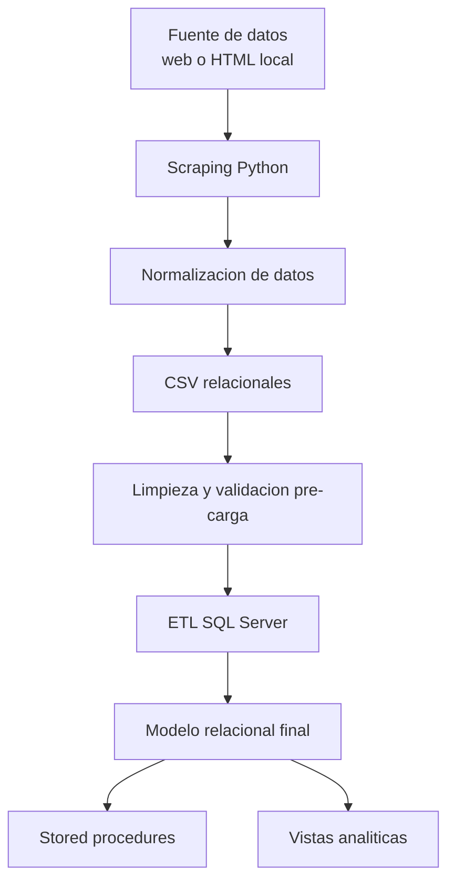
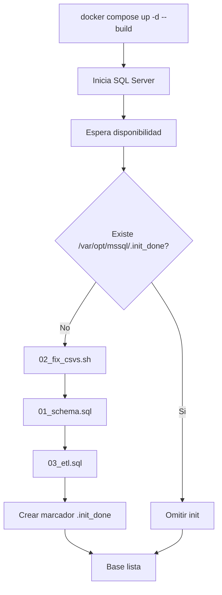
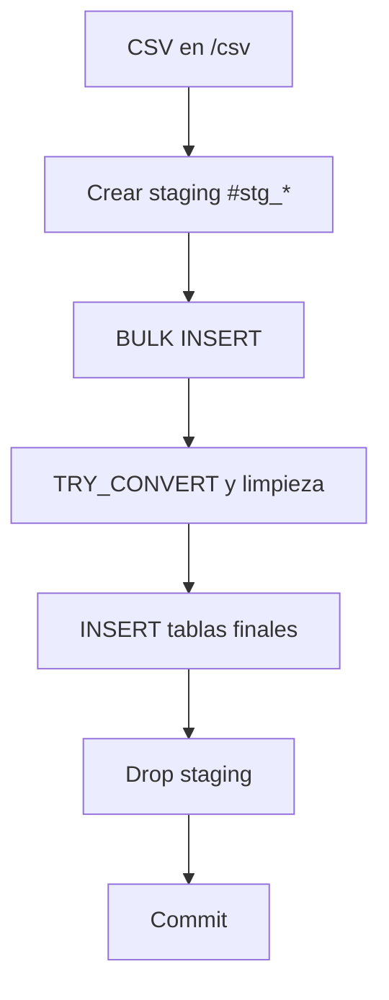

# Manual Tecnico del Proyecto Mundiales

## 1. Proposito del manual

Este documento unifica la documentacion tecnica del proyecto en un solo lugar.

Objetivos:
- Explicar de forma ordenada el funcionamiento completo del sistema.
- Documentar arquitectura, flujo de datos, scripts, base de datos y operacion.
- Servir como referencia tecnica para mantenimiento y extension futura.

## 2. Vision general del proyecto

El proyecto construye una base de datos historica de Copas del Mundo de futbol a partir de scraping, normalizacion y carga en SQL Server.

Flujo global:



Alcance aproximado del dataset:
- 23 ediciones de mundial
- 888+ partidos
- 1000+ jugadores
- 230+ selecciones

## 3. Estructura del repositorio

Estructura funcional:

```text
bases2_proyecto1/
|-- README.md
|-- Dockerfile
|-- docker-compose.yml
|-- docker/
|   `-- init/
|       |-- run_init.sh
|       |-- 01_schema.sql
|       |-- 02_fix_csvs.sh
|       `-- 03_etl.sql
|-- py/
|   |-- scraping_normalizado.py
|   |-- normalizacion_csv.py
|   `-- db/
|       |-- sqlserver_schema.sql
|       |-- sqlserver_etl.sql
|       |-- stored_procedures.sql
|       |-- modelo_wc.dbml
|       `-- ejemplos_procedure.txt
|-- datos_normalizados_web/
|-- datos_normalizados_local/
|-- html_descargados/
`-- docs/
    `-- manualtecnico.md
```

## 4. Requisitos tecnicos

### 4.1 Requisitos de ejecucion

- Docker Desktop
- Python 3.8+
- En modo web: Microsoft Edge instalado (Windows)
- SQLCMD disponible dentro del contenedor

### 4.2 Dependencias Python

```bash
pip install pandas beautifulsoup4
```

## 5. Capa de extraccion y transformacion en Python

### 5.1 Script scraping_normalizado.py

Responsabilidad principal:
- Obtener HTML desde web o desde cache local.
- Parsear estructura HTML.
- Extraer entidades y eventos de partido.
- Producir datos intermedios consistentes.

Modos de ejecucion:
- Local: usa html_descargados/
- Web: consulta sitio en vivo

Comandos base:

```bash
python py/scraping_normalizado.py --origen local --html-dir ./html_descargados --salida ./datos_normalizados_local
python py/scraping_normalizado.py --origen web --pausa 2 --salida ./datos_normalizados_web
```

Opciones utiles:
- --anio
- --seccion
- --limite-jugadores
- --pausa

### 5.2 Script normalizacion_csv.py

Responsabilidad principal:
- Tomar datos intermedios del scraper.
- Aplicar transformaciones al modelo relacional final.
- Separar tablas por grano y tipo de entidad.
- Deduplicar y estandarizar valores.

Reglas relevantes:
- Separa premios de jugador y seleccion.
- Separa plantel de jugador y entrenador.
- Mantiene tabla de trazabilidad para identidades ambiguas.

## 6. Dataset de salida (CSV normalizados)

El pipeline genera los siguientes CSV finales:

- mundial.csv
- seleccion.csv
- seleccion_alias.csv
- jugador.csv
- entrenador.csv
- partido.csv
- aparicion_partido.csv
- direccion_tecnica_partido.csv
- gol.csv
- tarjeta.csv
- cambio.csv
- penal.csv
- grupo.csv
- posicion_final.csv
- goleador.csv
- premio_jugador.csv
- premio_seleccion.csv
- plantel_jugador.csv
- plantel_entrenador.csv
- participacion_mundial.csv
- resolucion_identidad_jugador.csv

Notas:
- resolucion_identidad_jugador.csv se garantiza aunque no existan casos ambiguos.
- El dataset final recomendado para carga es datos_normalizados_web/.

## 7. Capa Docker e inicializacion

### 7.1 Dockerfile

Construye una imagen basada en SQL Server 2022 e instala:
- python3
- dos2unix
- mssql-tools18 (sqlcmd)

Adicionalmente:
- Copia scripts de init.
- Convierte finales de linea CRLF a LF para scripts shell.

### 7.2 docker-compose.yml

Define servicio db:
- Puerto 1433
- Volumen persistente mssql_data
- Montaje de scripts SQL en /db_scripts
- Montaje de CSV en /csv
- Arranque con run_init.sh

### 7.3 Flujo run_init.sh



## 8. Limpieza pre-ETL: 02_fix_csvs.sh

Objetivo:
- Normalizar texto para evitar problemas de codificacion en SQL Server Linux.
- Corregir tipos numericos y booleanos.
- Eliminar duplicados por llaves primarias.
- Garantizar la existencia de resolucion_identidad_jugador.csv.

Transformaciones importantes:
- Tildes y diacriticos a ASCII.
- Valores bool a 1/0.
- Enteros con decimal (ej. 1454.0) a entero limpio.

Ejemplos de normalizacion:
- Espana (en lugar de España)
- Belgica (en lugar de Bélgica)
- Mexico (en lugar de México)

## 9. Base de datos relacional (SQL Server)

### 9.1 Esquema

Definido en py/db/sqlserver_schema.sql.

Principios del modelo:
- Tablas en singular.
- Llaves tecnicas bigint.
- Integridad referencial con claves foraneas.
- Indices para consultas frecuentes.

### 9.2 Entidades principales

Catalogos:
- mundial
- seleccion
- seleccion_alias
- jugador
- entrenador

Hechos de partido:
- partido
- aparicion_partido
- direccion_tecnica_partido
- gol
- tarjeta
- cambio
- penal

Hechos por edicion:
- grupo
- posicion_final
- goleador
- premio_jugador
- premio_seleccion
- plantel_jugador
- plantel_entrenador
- participacion_mundial

Trazabilidad:
- resolucion_identidad_jugador
- vista v_evento_jugador_pendiente

### 9.3 Diagrama

El modelo logico esta en py/db/modelo_wc.dbml.

## 10. ETL SQL (sqlserver_etl.sql)

Objetivo:
- Cargar CSV normalizados dentro de tablas finales SQL Server.

Estrategia:
- Transaccion completa con TRY/CATCH.
- Uso de tablas staging #stg_*.
- BULK INSERT por archivo.
- Transformacion con TRY_CONVERT y limpieza de espacios.
- Insercion a tablas destino.

Flujo:



## 11. Stored procedures

Implementados en py/db/stored_procedures.sql.

### 11.1 sp_mundial_por_anio

Proposito:
- Desplegar informacion integral de una edicion del mundial.

Parametros:
- @anio obligatorio
- @grupo opcional
- @pais opcional
- @fecha opcional

Secciones que entrega:
- Resumen del mundial
- Posiciones finales
- Tabla de grupos
- Partidos y resultados
- Detalle de goles
- Goleadores
- Premios
- Tarjetas
- Planteles
- Entrenadores

Ejemplo:

```sql
EXEC dbo.sp_mundial_por_anio @anio = 2022;
```

### 11.2 sp_historial_pais

Proposito:
- Mostrar historial completo de una seleccion.

Parametros:
- @pais obligatorio
- @anio opcional

Secciones que entrega:
- Resumen historico
- Participaciones por edicion
- Mundiales como sede
- Desempeno en grupos
- Partidos historicos
- Goles por jugador y edicion
- Top goleadores historicos
- Premios
- Entrenadores
- Jugadores mas convocados

Ejemplo:

```sql
EXEC dbo.sp_historial_pais @pais = 'Argentina';
```

Regla importante:
- Usar nombres sin tildes (Espana, Mexico, Belgica).

## 12. Vistas SQL (lineamientos)

Estado actual:
- El plan de vistas esta definido y se puede extender en py/db.

Objetivo de vistas:
- Simplificar consultas complejas.
- Estandarizar reportes.
- Facilitar analitica y consumo BI.

Lineamientos recomendados:
- Prefijo v_
- Nombres en snake_case
- Columnas con aliases consistentes
- Documentar objetivo y campos

Ejemplo base:

```sql
CREATE OR ALTER VIEW dbo.v_partido_completo AS
SELECT p.partido_id, p.anio, p.fecha, p.etapa,
       sl.nombre AS seleccion_local,
       sv.nombre AS seleccion_visitante,
       p.goles_local, p.goles_visitante
FROM dbo.partido p
JOIN dbo.seleccion sl ON sl.seleccion_id = p.local_seleccion_id
JOIN dbo.seleccion sv ON sv.seleccion_id = p.visitante_seleccion_id;
```

## 13. Operacion diaria

### 13.1 Levantar el sistema

```bash
docker compose up -d --build
```

### 13.2 Verificar estado

```bash
docker logs mundiales_db -f
```

### 13.3 Conteos rapidos

```bash
docker exec -i mundiales_db /opt/mssql-tools18/bin/sqlcmd -C -S localhost -U sa -P "Mundiales2026!" -d mundiales -Q "SELECT COUNT(*) AS partidos FROM dbo.partido;"
```

### 13.4 Reinicio completo

```bash
docker compose down -v
docker compose up -d --build
```

## 14. Validaciones tecnicas recomendadas

Consultas SQL base:

```sql
SELECT COUNT(*) AS mundial FROM dbo.mundial;
SELECT COUNT(*) AS seleccion FROM dbo.seleccion;
SELECT COUNT(*) AS jugador FROM dbo.jugador;
SELECT COUNT(*) AS entrenador FROM dbo.entrenador;
SELECT COUNT(*) AS partido FROM dbo.partido;
SELECT COUNT(*) AS gol FROM dbo.gol;
SELECT COUNT(*) AS participacion FROM dbo.participacion_mundial;
SELECT COUNT(*) AS pendientes_resolucion FROM dbo.v_evento_jugador_pendiente;
```

## 15. Troubleshooting

Problemas frecuentes y acciones:

1. SQL Server no responde al iniciar
- Revisar logs del contenedor.
- Esperar fin de inicializacion.

2. Falla BULK INSERT
- Verificar montajes /csv y /db_scripts.
- Confirmar existencia de CSV esperados.

3. Errores por tildes en consultas
- Usar nombres normalizados sin tildes.

4. Reproceso total de datos
- Ejecutar docker compose down -v y luego docker compose up -d --build.

## 16. Seguridad y operacion

Recomendaciones:
- Cambiar la contrasena SA en entornos no academicos.
- No versionar credenciales reales.
- Respaldar volumen mssql_data para preservar datos.

## 17. Mantenimiento y extension

Tareas sugeridas:
- Versionar vistas SQL en archivo dedicado.
- Documentar cada vista con objetivo, campos y ejemplo.
- Medir tiempos de consultas y ajustar indices.
- Incorporar capa de consumo BI y tableros.

## 18. Resumen ejecutivo tecnico

El sistema esta compuesto por:
- Extraccion y normalizacion con Python.
- Limpieza pre-carga para robustez en SQL Server Linux.
- ETL transaccional con staging tables.
- Modelo relacional normalizado y consultable.
- Stored procedures para analisis operativo.
- Base preparada para evolucion a vistas analiticas y BI.

Ultima actualizacion: Marzo 20, 2026.
